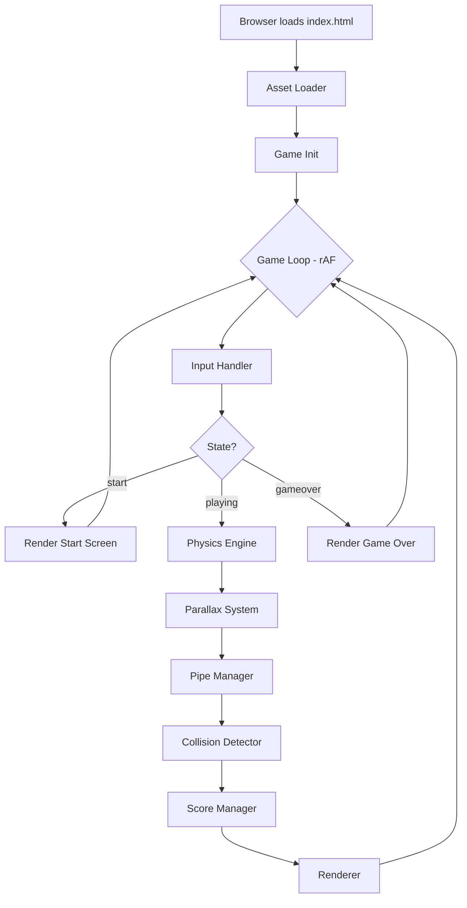
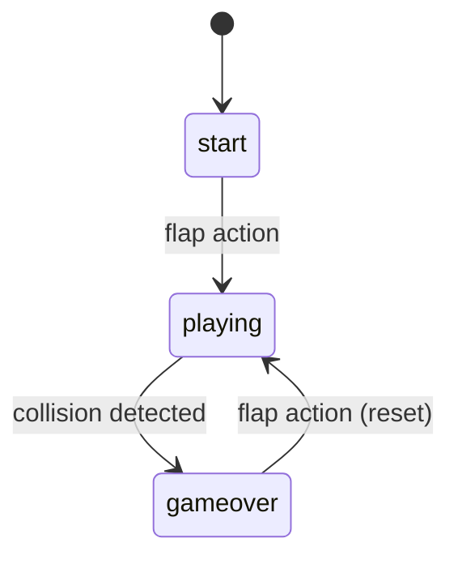

# Design Document: Flappy Kiro

## Overview

Flappy Kiro is a single-file (or minimal-file) browser-based HTML5 Canvas game implemented in vanilla JavaScript. No build tools or frameworks are required — the game runs by opening `index.html` directly in a browser.

The architecture follows a classic game-loop pattern: a fixed `requestAnimationFrame` loop drives physics updates, input processing, collision detection, scoring, and rendering each frame. Game state is modeled as a simple enum (`start`, `playing`, `gameover`) that gates which subsystems are active.

Assets are loaded at startup from the `assets/` directory. The canvas is sized to the browser viewport and re-sized on `window.resize`.



---

## Architecture

### Game Loop

The main loop runs via `requestAnimationFrame`. Each tick:

1. Compute `deltaTime` (capped to avoid spiral-of-death on tab blur)
2. Process pending input events
3. If `playing`: update physics, parallax, pipes, collision, score
4. Render the current frame

### State Machine



### Subsystem Responsibilities

| Subsystem | Responsibility |
|---|---|
| InputHandler | Captures Space/click/touch, emits flap events |
| PhysicsEngine | Applies gravity + flap velocity to Ghosty |
| PipeManager | Spawns, scrolls, and culls pipe pairs |
| ParallaxSystem | Manages cloud layers at varying speeds/opacities |
| CollisionDetector | Circle-vs-rect checks between Ghosty and pipes; scalar ceiling/ground checks |
| ScoreManager | Tracks current score, updates and persists high score |
| AudioManager | Loads and plays jump.wav / game_over.wav |
| Renderer | Draws all visual elements to the canvas each frame |

---

## Components and Interfaces

### InputHandler

```js
// Listens to keydown (Space), mousedown, touchstart on canvas
// Sets a pending flap flag consumed once per frame
inputHandler.consumeFlap() → boolean
```

### PhysicsEngine

```js
physicsEngine.flap()                    // sets vy = FLAP_VELOCITY
physicsEngine.update(dt)               // vy += GRAVITY * dt; y += vy * dt; clamp vy
physicsEngine.getState() → { x, y, vy }
physicsEngine.reset()
```

### PipeManager

```js
pipeManager.update(dt)                 // scroll pipes left, cull off-screen, spawn new
pipeManager.getPipes() → Pipe[]        // array of active pipe pairs
pipeManager.reset()
```

### ParallaxSystem

```js
parallaxSystem.update(dt, isPlaying)   // scroll each layer; always runs (even on start/gameover)
parallaxSystem.getLayers() → CloudLayer[]
parallaxSystem.reset()
```

### CollisionDetector

```js
// Uses circle-vs-rect for pipe collisions, scalar comparisons for ceiling/ground
collisionDetector.check(ghostState, pipes, canvasHeight, scoreBarHeight) → boolean
// ghostState must include: { x, y, width, height } — center and radius derived internally
```

### ScoreManager

```js
scoreManager.update(ghostState, pipes) // increments score when ghost passes pipe center
scoreManager.getScore() → number
scoreManager.getHighScore() → number
scoreManager.saveHighScore()           // persists to localStorage
scoreManager.reset()
```

### AudioManager

```js
audioManager.playJump()
audioManager.playGameOver()
// Defers playback until first user gesture (Web Audio unlock pattern)
```

### Renderer

```js
renderer.drawStartScreen(ghostState, score, highScore)
renderer.drawPlayFrame(ghostState, pipes, clouds, score, highScore)
renderer.drawGameOver(score, highScore)
// All draw calls happen on a single 2D canvas context
```

---

## Data Models

### GameState (enum)

```js
const STATE = { START: 'start', PLAYING: 'playing', GAMEOVER: 'gameover' }
```

### GhostyState

```js
{
  x: number,       // fixed horizontal position (canvas center-left)
  y: number,       // vertical position (top of sprite)
  vy: number,      // vertical velocity (positive = downward)
  width: number,   // sprite render width
  height: number,  // sprite render height
  // collision circle derived from config: center = (x + width/2, y + height/2), r = GHOSTY_RADIUS
}
```

### Pipe

```js
{
  x: number,         // left edge of pipe column
  gapTop: number,    // y coordinate of top of gap
  gapBottom: number, // y coordinate of bottom of gap
  width: number,     // pipe column width
  passed: boolean,   // true once Ghosty's center has crossed pipe center
  active: boolean    // pool flag: true = in use, false = available for reuse
}
```

### CloudLayer

```js
{
  speed: number,    // pixels per second scroll speed
  opacity: number,  // 0–1 fill opacity
  scale: number,    // relative size multiplier
  clouds: Cloud[]   // individual cloud shapes in this layer
}
```

### Cloud

```js
{
  x: number,   // left edge
  y: number,   // top edge
  r: number    // base radius for the puff circles
}
```

### Constants (tunable)

All numerical constants are extracted into a dedicated `config.js` file, loaded before `game.js` in `index.html`. This separates tunable parameters from game logic and makes balancing changes straightforward without touching game code.

**`config.js` structure (grouped by category):**

```js
// config.js — all tunable constants, grouped by category

// Physics
const GRAVITY          = 1800   // px/s²
const FLAP_VELOCITY    = -520   // px/s (upward)
const TERMINAL_VEL     = 900    // px/s (downward cap)
const DELTA_TIME_CAP   = 0.1    // seconds — max dt to prevent physics explosion on tab blur

// Pipes
const PIPE_SPEED       = 200    // px/s
const PIPE_INTERVAL    = 300    // px scrolled between spawns
const PIPE_WIDTH       = 60     // px
const PIPE_GAP         = 160    // px vertical gap height
const PIPE_GAP_MIN_Y   = 80     // px from top (min gap top)
const PIPE_POOL_SIZE   = 10     // pre-allocated pipe objects in the pool

// Ghosty
const GHOSTY_WIDTH     = 48     // px
const GHOSTY_HEIGHT    = 48     // px
const GHOSTY_RADIUS    = 18     // px — collision circle radius (slightly smaller than sprite)

// UI
const SCORE_BAR_HEIGHT = 48     // px

// Clouds
const CLOUD_LAYERS     = [
  { speed: 30,  opacity: 0.25, scale: 0.6 },  // far/slow
  { speed: 70,  opacity: 0.45, scale: 1.0 },  // near/fast
]
```

**`index.html` load order:**

```html
<script src="config.js"></script>
<script src="game.js"></script>
```


---

## Collision Detection

### Ghosty — Circular Hitbox

Rather than using an AABB for Ghosty, a circle hitbox is used. This better matches the rounded ghost sprite and feels fairer to the player (avoids corner-pixel deaths).

```
center_x = ghosty.x + ghosty.width  / 2
center_y = ghosty.y + ghosty.height / 2
radius   = GHOSTY_RADIUS   // defined in config.js, slightly smaller than sprite
```

### Pipe Walls — Rectangular AABB

Each pipe column is a plain axis-aligned rectangle:

```
top pipe:    { x: pipe.x, y: 0,            w: pipe.width, h: pipe.gapTop }
bottom pipe: { x: pipe.x, y: pipe.gapBottom, w: pipe.width, h: canvasHeight - pipe.gapBottom }
```

### Ground / Ceiling Detection

- Ceiling: collision when `center_y - radius < 0`
- Ground: collision when `center_y + radius > canvasHeight - SCORE_BAR_HEIGHT`

These are simple scalar comparisons — no rectangle needed.

### Circle vs. Rectangle Algorithm (Ghosty vs. Pipe)

To test whether a circle overlaps an AABB, clamp the circle center to the rectangle bounds and compare the squared distance to the squared radius:

```js
function circleVsRect(cx, cy, r, rx, ry, rw, rh) {
  // Find the closest point on the rect to the circle center
  const nearestX = Math.max(rx, Math.min(cx, rx + rw))
  const nearestY = Math.max(ry, Math.min(cy, ry + rh))
  const dx = cx - nearestX
  const dy = cy - nearestY
  return dx * dx + dy * dy < r * r
}
```

This is called twice per pipe pair (once for the top rect, once for the bottom rect).

---

## Performance

### Target Frame Rate

The game targets **60 FPS** via `requestAnimationFrame`. No fixed timestep is used; instead, `deltaTime` is computed each frame and capped:

```js
const dt = Math.min((now - lastTime) / 1000, DELTA_TIME_CAP)  // DELTA_TIME_CAP = 0.1s
```

Capping `dt` prevents the physics engine from producing large position jumps when the tab is backgrounded and then foregrounded.

### Sprite Batching

To minimize canvas state changes each frame:

1. Set `ctx.globalAlpha` and `ctx.fillStyle` once per logical group, not per object.
2. Draw all clouds in a single pass grouped by layer (same opacity/scale per layer).
3. Draw all pipes in a single pass (same fill style for all pipe bodies, then a second pass for caps).
4. Draw Ghosty last among game objects (single `drawImage` call).
5. Draw the score bar UI on top in one pass.

Avoid saving/restoring canvas state inside tight loops; only save/restore around the full render function if needed.

### Object Pooling for Pipes

Instead of allocating new pipe objects on each spawn and letting the GC collect off-screen ones, a fixed-size pool is pre-allocated at init time:

```js
// Pre-allocate pool at startup
const pipePool = Array.from({ length: PIPE_POOL_SIZE }, () => ({
  x: 0, gapTop: 0, gapBottom: 0, width: PIPE_WIDTH, passed: false, active: false
}))

function acquirePipe() {
  return pipePool.find(p => !p.active) ?? null  // returns null if pool exhausted
}

function releasePipe(pipe) {
  pipe.active = false  // returns it to the pool
}
```

`PipeManager.update()` calls `releasePipe()` on any pipe whose `x + width <= 0`, and calls `acquirePipe()` + resets fields when spawning a new pair. `getPipes()` returns only pipes where `active === true`.

`PIPE_POOL_SIZE` (default 10) is defined in `config.js` and should comfortably exceed the maximum number of pipes visible on screen at any canvas width.

---

## Correctness Properties

*A property is a characteristic or behavior that should hold true across all valid executions of a system — essentially, a formal statement about what the system should do. Properties serve as the bridge between human-readable specifications and machine-verifiable correctness guarantees.*

### Property 1: State transition on flap

*For any* game in the `start` or `gameover` state, triggering a flap action should transition the game to the `playing` state.

**Validates: Requirements 2.4, 2.5**

---

### Property 2: Physics gravity update

*For any* initial vertical velocity `vy` and time delta `dt`, after one physics update the new velocity should equal `vy + GRAVITY * dt` (clamped to TERMINAL_VEL), and the new position should equal `old_y + new_vy * dt`.

**Validates: Requirements 3.1, 3.3**

---

### Property 3: Flap overrides velocity

*For any* current vertical velocity value, calling `flap()` should always result in `vy === FLAP_VELOCITY`, regardless of the previous velocity.

**Validates: Requirements 3.2**

---

### Property 4: Terminal velocity clamp

*For any* downward velocity exceeding `TERMINAL_VEL`, after a physics update the resulting velocity should be clamped to exactly `TERMINAL_VEL`.

**Validates: Requirements 3.4**

---

### Property 5: Pipe scrolling and culling

*For any* active pipe and time delta `dt`, after `pipeManager.update(dt)` the pipe's `x` should decrease by `PIPE_SPEED * dt`. Furthermore, any pipe whose `x + width <= 0` should no longer appear in `getPipes()` after the update.

**Validates: Requirements 4.3, 4.4**

---

### Property 6: Pipe gap bounds

*For any* spawned pipe pair given a canvas height `h` and score bar height `s`, the gap top position should satisfy `PIPE_GAP_MIN_Y <= gapTop <= h - s - PIPE_GAP - PIPE_GAP_MIN_Y`, ensuring the gap is always reachable.

**Validates: Requirements 4.2**

---

### Property 7: Collision detection triggers game over

*For any* Ghosty circle (center, radius) and pipe configuration where the circle overlaps a pipe rectangle (via circle-vs-rect), or where Ghosty's circle exceeds the canvas top or score bar bottom, `collisionDetector.check()` should return `true` and the game should transition to `gameover`.

**Validates: Requirements 5.1, 5.2, 5.3, 5.4**

---

### Property 8: Score increments on pipe pass

*For any* pipe that Ghosty's horizontal center crosses during active play, the score should increase by exactly 1, and the `passed` flag on that pipe should be set to prevent double-counting.

**Validates: Requirements 6.1**

---

### Property 9: High score persistence

*For any* final score that exceeds the current high score, after the game transitions to `gameover`, `localStorage` should contain the new score as the high score.

**Validates: Requirements 6.3**

---

### Property 10: Frozen state in game over

*For any* game in the `gameover` state, calling the update loop should not change pipe positions, Ghosty's physics state, or the score.

**Validates: Requirements 7.3**

---

### Property 11: Cloud layer depth ordering

*For any* two cloud layers where layer A represents greater distance than layer B, layer A's `speed` and `opacity` and `scale` should all be strictly less than layer B's corresponding values.

**Validates: Requirements 11.3, 11.4**

---

### Property 12: Cloud wrapping

*For any* cloud whose `x + effectiveWidth <= 0` after a parallax update, the cloud should be repositioned to `x >= canvasWidth`, maintaining continuous scrolling.

**Validates: Requirements 11.5**

---

### Property 13: Clouds scroll in all states

*For any* game state (start, playing, or gameover), calling `parallaxSystem.update(dt)` should change cloud positions by the expected amount for each layer's speed.

**Validates: Requirements 11.3, 11.6**

---

### Property 14: Layout proportionality on resize

*For any* canvas dimensions `(w, h)`, layout-dependent values (score bar height, pipe gap min/max bounds) should be recalculated proportionally such that the game remains playable at any reasonable resolution.

**Validates: Requirements 10.2**

---

## Error Handling

| Scenario | Handling |
|---|---|
| Asset load failure (ghosty.png, .wav) | Log warning; fall back to colored rectangle for sprite, silent for audio |
| localStorage unavailable (private browsing) | Catch `SecurityError`; treat high score as session-only (in-memory) |
| `requestAnimationFrame` not available | Not supported; game requires a modern browser |
| Canvas 2D context unavailable | Display a static error message in the page body |
| Resize to zero dimensions | Guard against division-by-zero in layout recalculation; skip resize if `w === 0 || h === 0` |
| Tab blur / visibility change | Cap `deltaTime` to 100ms to prevent physics explosion on tab return |

---

## Testing Strategy

### Dual Testing Approach

Both unit tests and property-based tests are required. They are complementary:
- Unit tests catch concrete bugs at specific inputs and integration points
- Property tests verify universal correctness across the full input space

### Unit Tests

Focus on:
- Asset loader resolves/rejects correctly
- `InputHandler` emits flap on Space, click, and touch events
- `AudioManager` calls `play()` on the correct audio element
- `ScoreManager.reset()` zeroes score but preserves high score
- Start screen and game over screen render calls include expected text content
- Canvas resize updates `canvas.width` and `canvas.height` to match window

### Property-Based Tests

Use **fast-check** (JavaScript property-based testing library).

Each property test must run a minimum of **100 iterations**.

Each test must include a comment tag in the format:
`// Feature: flappy-kiro, Property N: <property_text>`

| Property | Test Description |
|---|---|
| Property 1 | For random non-playing states, flap transitions to playing |
| Property 2 | For random (vy, dt) pairs, physics update produces correct y and vy |
| Property 3 | For random vy values, flap() always sets vy to FLAP_VELOCITY |
| Property 4 | For random vy > TERMINAL_VEL, update clamps to TERMINAL_VEL |
| Property 5 | For random pipes and dt, x decreases correctly; off-screen pipes are culled |
| Property 6 | For random canvas heights, spawned pipe gapTop is always within bounds |
| Property 7 | For random circle/rect configurations, circle-vs-rect collision check returns correct result |
| Property 8 | For random pipe positions and ghost x values, score increments exactly once per pipe |
| Property 9 | For random (score, highScore) pairs where score > highScore, localStorage is updated |
| Property 10 | For random gameover states and dt values, update produces no state changes |
| Property 11 | For any generated layer config, depth ordering invariants hold |
| Property 12 | For random cloud positions and canvas widths, off-screen clouds wrap correctly |
| Property 13 | For random dt and any game state, cloud positions change by speed * dt |
| Property 14 | For random canvas dimensions, layout values remain proportional and in-bounds |

### Test File Structure

```
index.html          ← game entry point
config.js           ← all tunable constants grouped by category
game.js             ← all game logic (reads constants from config.js globals)
game.test.js        ← unit + property tests (using fast-check + vitest or jest)
```
